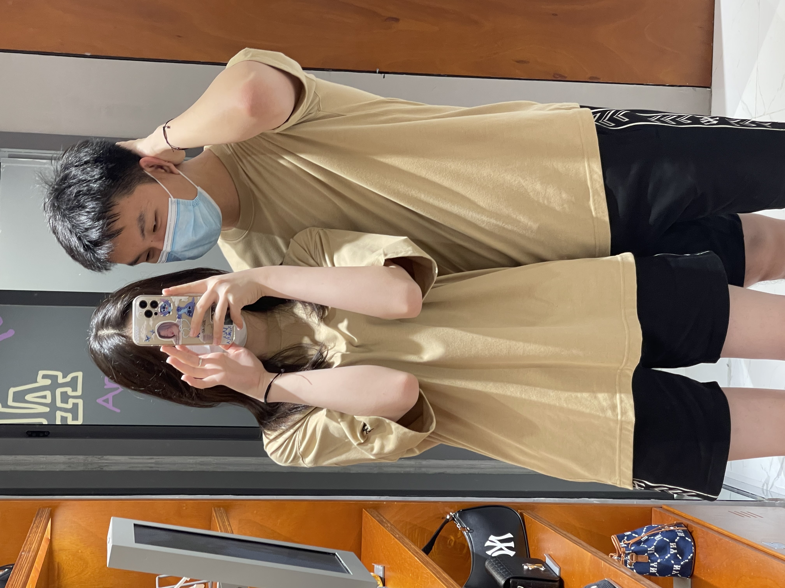

# **Xiaoyu Chen's Profile**
### Programming Knowledge
- OO design
- basic algorithms
- basic data structures 
- java, C++
- eclipse, vscode

### Relevant Coursework
- [x] CSE 11
- [x] CSE 12
- [x] CSE 15L
- [x] CSE 30
- [x] CSE 100
- [x] CSE 105
- [ ] CSE 101
- [ ] CSE 110
- [ ] CSE 158R
- [ ] CSE 167

### About Me
1. I am a CS major student at UCSD
2. Love bodybuilding, java programming, basketball
3. Graduated from Fishburne Military School\
My favorite quote:
>Any fool can write code that a computer can understand. Good programmers write code that humans can understand. 

### Pictures
**When I was 3 years old**

**Me and My Girl**

**Favorite dog**

**Be Aware**
- Use `git clone` to clone all the source code to your local machine
- Be sure to read the ***README File***
- This site was built using [Github flavored Markdown](https://docs.github.com/en/get-started/writing-on-github/getting-started-with-writing-and-formatting-on-github/basic-writing-and-formatting-syntax).

Here is a quick way to go back to [Xiaoyu Chen's Profile](#xiaoyu-chens-profile)